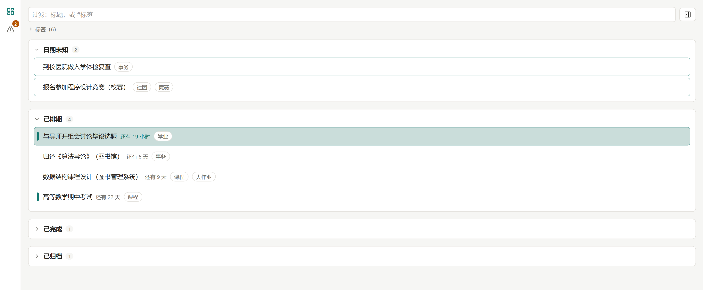
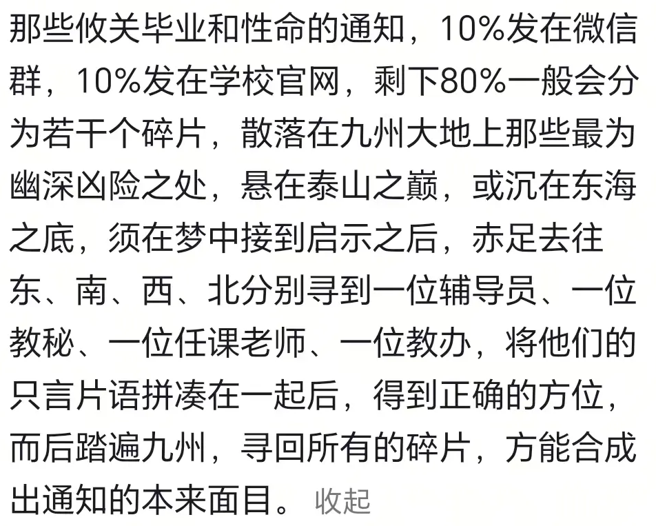
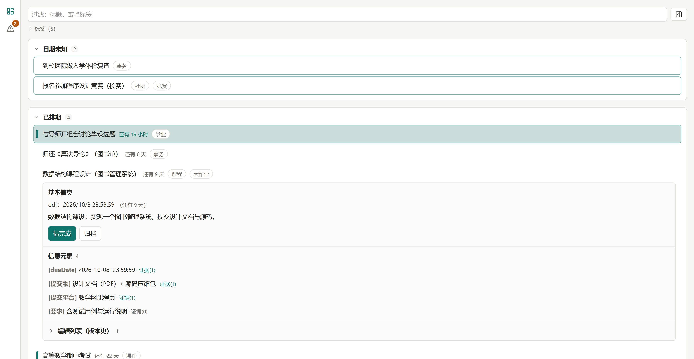
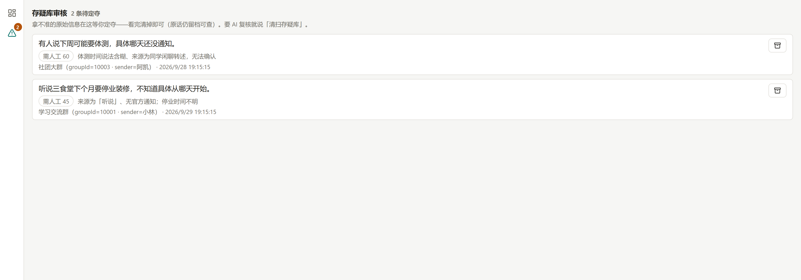
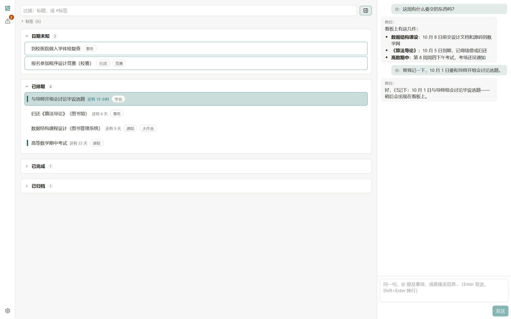
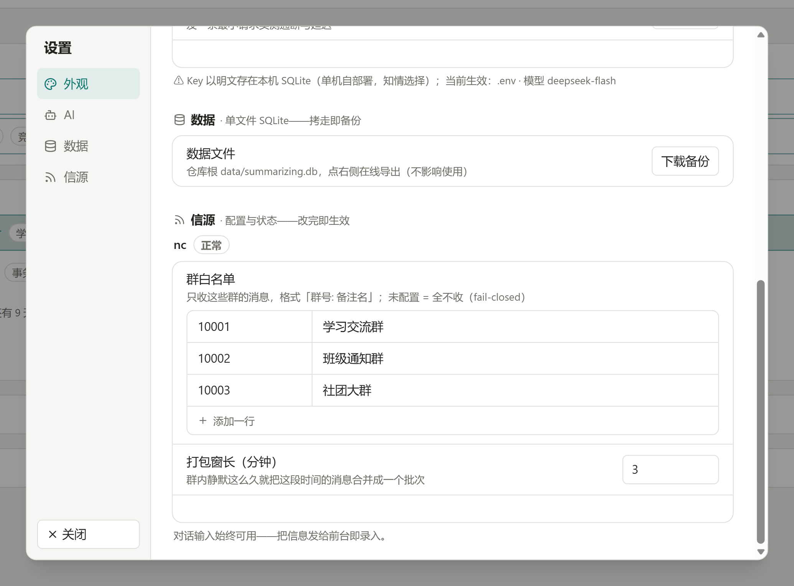
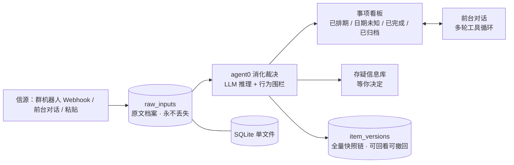

<h1 align="center">个人信息中枢 · Summarizing</h1>

<h3 align="center">从碎片信息到完整的事项。</h3>

<p align="center">
  <picture>
    <source media="(prefers-color-scheme: dark)" srcset="docs/assets/screenshot-board-dark.png" />
    
  </picture>
</p>

<p align="center">一条个人信息流水线：群通知、随手记、聊天碎片丢进来，AI 消化成完整的事项；拿不准的进存疑库，等你决定。</p>

<p align="center">
  <a href="#上手"><strong>上手</strong></a> &nbsp;·&nbsp;
  <a href="#界面一览"><strong>界面一览</strong></a> &nbsp;·&nbsp;
  <a href="#支持什么"><strong>支持什么</strong></a> &nbsp;·&nbsp;
  <a href="SOURCE-GUIDE.md"><strong>开发信源</strong></a> &nbsp;·&nbsp;
  <a href="#设计文档"><strong>设计文档</strong></a> &nbsp;·&nbsp;
  <a href="LICENSE"><strong>AGPL-3.0</strong></a>
</p>

<p align="center">
  <a href="#"></a>
  <a href="#"></a>
  <a href="#"></a>
  <a href="#"></a>
  <a href="#"></a>
  <a href="#"></a>
  <a href="#"></a>
</p>

## 它解决什么



重要的通知总是散得到处都是：群里一半、官网一半，剩下的在几位老师的只言片语里。Summarizing 把它们收进同一个地方，由 AI 整理成完整的事项：带日期、带要素、带来源；整理不了的进存疑库。

## 支持什么

- **四段看板**：已排期 / 日期未知 / 已完成 / 已归档；按截止时间排序，标不标日期都不会被硬凑。
- **群机器人接入**：群里消息自动进站，按白名单过滤，合并成批后自动消化成事项。
- **对话录入**：像聊天一样丢信息，AI 自己判断怎么处理；也可以 @ 提及看板上的事项。
- **自动整理**：抽日期、抽要素、找归属、合并同一件事的多次提及；推断出来的日期会标「推断」。
- **证据链**：事项的每个元素都能点开查来源——逐字引文、来源身份、原始批次。
- **存疑信息库**：拿不准的先存进库里，之后可以合并、丢弃，也可以让 AI 定期复核。不确定就不猜。
- **修改留痕**：每次改动都追加一份完整快照，历史随时可查。
- **信源可扩展**：新的消息来源按统一契约接入（[开发信源 →](SOURCE-GUIDE.md)）；信源自己声明设置项，界面自动渲染表单。
- **单机自托管**：SQLite 单文件，数据全在本地；AI 走 OpenAI 兼容接口，可接本地模型。
- **深色模式**，手机也能用。

## 上手

要求：Node.js ≥ 22。

```bash
npm install
cp .env.example .env      # 填一个 OpenAI 兼容接入（如 DeepSeek / 本地模型）
npm run seed:demo          # 可选：载入一套虚构演示数据（会清空当前库）
npm run dev                # web: http://localhost:5173 · server: http://localhost:3001
```

装完之后，常用检查：

```bash
npm test              # vitest（221 个用例）
npm run check         # 类型 + 代码规范 + 测试
npm run check:dead    # 死代码检查
npm run build -w @summarizing/web
```

## 界面一览

<sub>看板 → 事项 · 四段 · 元素与证据</sub>



四段看板按截止时间排；点开一行是展开体——每个信息元素都挂着证据，点「证据 (n)」看到的是原文里的逐字引文。

<sub>存疑库 · 等人工决定</sub>



拿不准的进存疑库：原话、来源、待判断程度都在。看完清掉，或者交给 AI 复核。

<sub>对话 · 怎么丢都行</sub>



所有东西都可以像聊天一样丢进来；AI 用自然语言回复（Markdown 渲染）——该建事项的建，拿不准的进存疑库。

<sub>设置 · 信源自动渲染表单</sub>



信源（消息来源）自己声明有哪些设置项，界面自动生成表单——改完即生效，没有保存按钮。

<details>
<summary>架构与实现细节（工程向）</summary>



- **原文先行**：一切先落 `raw_inputs` 原文档案；AI 的输出永远只是派生结果，可回溯到原话。
- **证据链，不打分**：元素 → 逐字引文 → 原始批次，全链路可查；不生成「可信度」这类再生成值。
- **行为围栏**：代码只校验行为——动作白名单、引文逐字、引用存在；不评判 AI 判断得对不对。
- **全量快照版本链**：每次变更追加完整快照，当前视图取最新；历史可回看。
- **信源契约**：适配器按统一契约接入，core 不认识具体信源；设置项声明式渲染。

</details>

## 目录结构

```
apps/server        Fastify + SQLite：存储 / 消化裁决（agent0）/ 信源宿主
apps/web           React 19 + Tailwind v4：看板 / 存疑审核 / 对话 / 设置
packages/shared    跨边界契约（zod schema 单一来源）
docs/              设计文档：数据契约 / 规格 / 决策台账 / 信源开发指南…
scripts/           db:reset / seed:demo 等运维脚本
```

## 设计文档

`docs/` 不是面向读者的文档——它是这个项目与 AI 协作者一起工作时的「记忆」：约束、决策、验收都留档，与代码同步演进（带着编号和修订批注，是正常的）：

| 文档 | 内容 |
| --- | --- |
| `docs/00-数据契约.md` | 数据层权威契约（表、字段、不变量） |
| `docs/01-规格.md` | 行为层权威规格（01§4.x 各子系统） |
| `docs/02-决策台账.md` | 全部决策编号（D-xx）与延后项（L-xx） |
| `docs/04-验收.md` | 验收清单与真实走查记录 |
| `docs/05-UI重搓.md` | UI 定稿（布局 / 看板 / 对话 / 设置） |
| `docs/07-接新源检查单.md` | 信源的内部检查单（面向 core 维护者） |
| `docs/08-nc对接指南.md` | 群机器人信源对接操作手册 |

本项目定位单机自用：多用户、云同步、原生移动 App 不在当前范围内。

## License

[AGPL-3.0](LICENSE)。自由使用、修改、自托管；把修改版作为网络服务对外提供时，须按同许可证开源。
